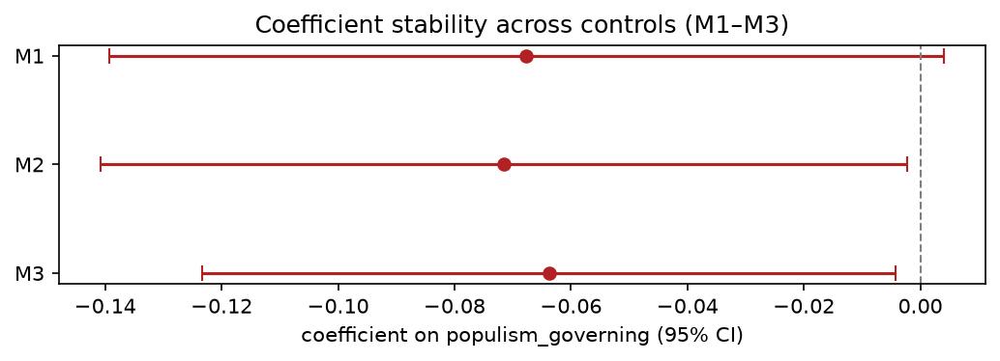
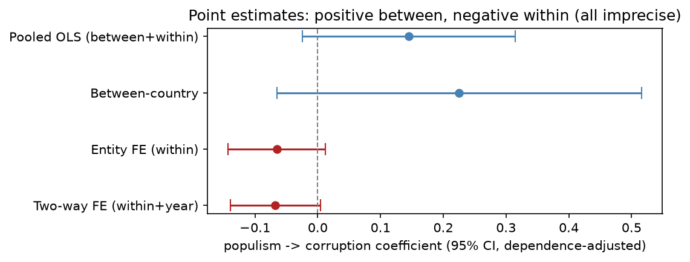
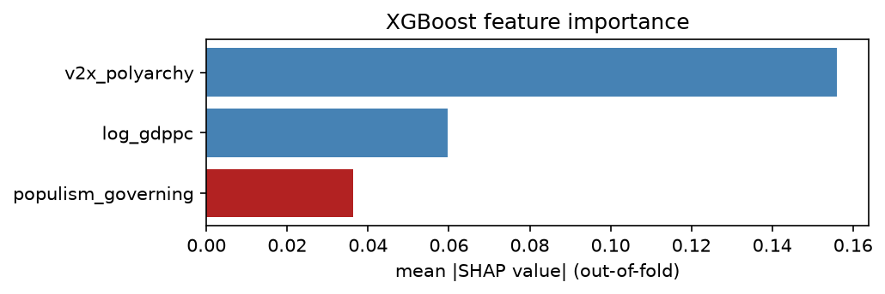

# What we did, and why — the Association analysis (Task 3)

A plain-language, detailed record of the association work: every step, the reasoning behind it, and the
actual numbers. This is **not** the report and not the report's structure — it's the explanatory
document a teammate (or future-us) reads to understand exactly what was done and why each choice was
made. The runnable version is `notebooks/03_association.ipynb`; the logic lives in `src/association/`.
Figures are saved in `docs/figures/association/`.

---

## 1. The question, in plain words

We want to know whether **populist governments are associated with more political corruption**. The
trap is that there are two completely different questions hiding in that sentence:

- **Between countries:** "Are countries that tend to elect populists more corrupt than countries that
  don't?" — this can be true just because both populism and corruption grow in the same kind of place
  (weak institutions, certain regions, certain histories).
- **Within a country:** "In years when a particular country has a more populist government, does *that
  same country* also have more corruption?" — this within-country comparison is much harder to fake than
  the cross-country one. (Note: we compare populism and corruption in the *same year* — whether one
  *precedes* the other is a separate, Task-4 question.)

Our whole job in Task 3 is to answer the **within-country** version honestly. (The *direction* of any
relationship — does populism come first, or corruption? — is Task 4. The breakdown by branch of
government is Task 5. Both are teammates' work and deliberately out of scope here.)

## 2. The data we used (one line, details in `notes_for_report.md`)

One row per country per year, 1970–2019: a **populism score for the governing party**
(`populism_governing`, 0–1) and a **corruption score** (`v2x_corr`, 0–1, higher = more corrupt), plus
GDP per capita and an electoral-democracy score as controls. After filtering and merging this is
**3,965 country-years across 96 countries**. The populism number is forward-filled between elections
(a governing party's score is assumed constant until the next election) — a modelling assumption the
preprocessing teammate documented.

## 3. What we did, step by step (and why each step)

### Step A — We first asked: is there even enough *within-country* movement to study?
**Why:** the method we're about to use (fixed effects) only learns from how a country changes over
time, ignoring differences between countries. If populism almost never moves within a country, the
method has nothing to work with, and a "no result" would be meaningless.
**What we found:** about **44%** of the variation in governing-party populism is *within* countries
(the rest is between). That's enough movement that a within-country estimate is meaningful — but **not**
enough to call a small estimate "definitively zero": the predictor is forward-filled and only updates
around elections, so there are far fewer *distinct* government-populism transitions than the ~3,900 rows
suggest. Power is limited, so we treat near-zero estimates as *imprecise*, not as proof of no effect.

### Step B — We measure how sticky corruption is (the persistence model).
**Why:** corruption barely changes from one year to the next, and that matters for interpretation. We
regress corruption on *last year's* corruption to quantify the stickiness.
**What we found:** last year's corruption explains ~**89%** of this year's (it's extremely sticky).
**This is *not* a performance bar the static models must "beat"** — it is a *dynamic* model with a lagged
outcome, a different specification and a different estimand, so its R² is not comparable to the static
M1–M3 fit. It simply documents that any single-year predictor has little year-to-year movement to explain.

### Step C — The core model: a fixed-effects regression.
**What a "fixed effect" is, plainly:** we subtract each country's own long-run average corruption (so
"Denmark is always clean" is removed) and each year's global average (so "the whole world got cleaner
in the 2000s" is removed). Whatever is left is the *ups and downs of one country around its own
normal*. We then ask: do a country's populism ups-and-downs line up with its corruption ups-and-downs?
This is the **two-way fixed-effects** model, and it is the right tool *because the question is
within-country* — not because it fits best.

We built it as four nested versions, adding one control at a time, to check the populism number is
stable and not an artefact of leaving something out:
- **M1**: populism only (+ country & year fixed effects)
- **M2**: + GDP per capita (richer countries are cleaner — control for it)
- **M3**: + electoral democracy (maybe it's really a democracy story — control for it)
- **M4**: + last year's corruption (a stricter "short-run" version — see Step E)

**Two supporting choices, explained:**
- *Shared sample for the static models M1–M3.* These three use different columns, so if each dropped its
  own missing rows we couldn't tell whether a changing coefficient came from the new control or a changed
  sample. So **M1–M3 share one stability sample** (3,940 country-years, 95 countries — complete on
  populism, log GDP and polyarchy). **M4 is different:** it adds last year's corruption (a different,
  dynamic estimand), so it is fit **separately on its own complete-case sample** (3,845 country-years)
  rather than forcing M1–M3 to drop each country's first year.
- *Clustered standard errors.* Readings from the same country across years aren't independent (shared
  institutions). We widen the confidence intervals to account for that, so we don't fool ourselves
  with intervals that are too narrow.

**What we found (the headline).** The populism coefficient is small and **consistently negative** (about
−0.06 to −0.07) and barely moves as controls are added. Its significance depends on the specification:
M1 (no controls) includes zero, but **M2 and M3 — the controlled static models — are significant at the
5% level** (p ≈ 0.043 and 0.036; intervals exclude zero). So within a country, more governing populism
goes with **slightly *less*** measured corruption once GDP and democracy are held fixed — the **opposite
sign** to the +0.14 pooled correlation (Step D explains why). This is *not* "no relationship", and it is
emphatically *not* the hypothesised *positive* effect. (The tiny/negative within-R² is about predictive
fit, not about the coefficient's sign.)

### Step D — We located where the "obvious" positive correlation actually lives.
**Why:** the EDA found a positive populism–corruption correlation (+0.12). The within-country models give
a *negative* sign — so where did the positive +0.14 go? We ran the *same* relationship four ways to see
(reproducible via `fit_between_within_comparison`).

**What we found:**

All four use **dependence-adjusted** standard errors (pooled clustered by country, between robust):

| How we look at it | populism → corruption | p-value | Meaning |
|---|---|---|---|
| Pooled (everything together) | **+0.14** | 0.09 | matches the EDA's sign, but **not** significant once clustered |
| Between countries only | +0.22 | 0.13 | cross-country pattern, **imprecise** |
| Within country (country FE) | **−0.07** | 0.10 | sign flips negative; not sig on its own |
| Within country + year FE | **−0.07** | 0.07 | same |

So the **point estimates flip sign** — positive across countries, negative within — but in this
single-predictor view **none is statistically significant** once panel dependence is handled. We therefore
say the cross-country association is *positive but imprecise*, **not** "clearly positive" or "entirely
between." The *significant* negative within-country estimate appears only once GDP and democracy are
controlled (M2/M3, Step C).

### Step E — M4: the stricter short-run version (reported separately on purpose).
**Why separate:** M4 adds last year's corruption as a predictor. That changes the question from "level
of corruption" to "the small year-to-year change not already explained by last year." Because
corruption is so sticky, that leftover is tiny, so the populism number mechanically shrinks to ~0.
That shrinkage is *expected* and is **not** evidence the result is fragile — which is why we keep M4
out of the stability picture and label it clearly.

### Step F — We checked we picked the right *kind* of model: the Hausman test.
**Plainly:** there are two ways to handle country baselines — "fixed effects" (estimate each freely,
safe) and "random effects" (assume baselines are unrelated to populism, a stronger and usually
unrealistic assumption). We chose fixed effects on principle. The Hausman test is a formal check of
whether the random-effects shortcut would have been okay. **It is a diagnostic, not a decision** — we
wouldn't switch even if it passed. It strongly rejects random effects (so fixed effects is the safe
choice), though the test's internal maths is numerically shaky here (a known issue), so we lean on the
principled reason rather than the test alone.

### Step G — A flexible "second opinion": XGBoost with honest cross-validation.
**Why:** maybe a straight-line regression misses a curved or interaction-y relationship. A flexible
machine-learning model (gradient-boosted trees) can catch those. We use it as a **sanity check**, not
as the answer.
**How we kept it honest:**
- *Hold out whole countries* (GroupKFold, balanced across world regions): we train on some countries
  and test on countries the model has never seen — the right test for "does this generalise across
  countries?".
- *Raw features, no per-country demeaning:* demeaning a country and then hiding it would secretly leak
  that country's average into the test — so we don't.
- The honest catch: with raw features the model can use *between*-country differences (rich, democratic
  countries are cleaner) that fixed effects throw away — so its accuracy will *look* better than the
  fixed-effects fit **by design**. That's why we read the **SHAP feature-importance ranking**, not the
  accuracy race.
**What we found:** out-of-fold R² ≈ 0.45 (vs a plain linear model's 0.38 on the same splits), but
**populism is the *least* important of the three features** — democracy and GDP do almost all the work.
Even a model free to use every scrap of cross-country signal barely leans on populism. Same verdict as
fixed effects.

### Step H — Robustness: we stress-tested the conclusion (not a "pick the best model" contest).
**An important principle:** we deliberately do **not** choose the best-fitting model. For this kind of
question that would be wrong — the best-fitting model (pooled OLS) is the *confounded* one. Instead we
re-run the same model several ways and check the conclusion is **stable**.
- *Three standard-error recipes* (cluster-by-country, two-way cluster, Driscoll–Kraay which also
  handles global corruption "waves"): all give the **same** coefficient (−0.072); only the interval
  changes. So the inference doesn't hinge on one SE choice.
- *First-difference estimator* removes country baselines a totally different way (by subtracting
  consecutive years instead of country averages). It agrees there's no positive effect (−0.024, not
  distinguishable from zero).
**Honest nuance it revealed:** the small negative coefficient is *robustly never positive*, but its
significance depends on the recipe (significant under clustering and Driscoll–Kraay, not significant
under first-difference). So the careful statement is: *the within-country association is negative,
significant in the controlled static specs but not in every robustness variant — and never the
hypothesised positive.*

### Step H2 — The association is not uniform: it depends on democracy.
We added a populism × democracy (polyarchy) interaction, and it is **statistically significant**. On its
own an interaction coefficient is not interpretable, so we computed the **model-implied marginal slope of
populism at low / median / high polyarchy** (`interaction_marginal_effects`) — these are slopes implied by
the one fitted linear-interaction model, **not** separate regressions on subsets of countries:

| Polyarchy level | Model-implied marginal slope | Significant? |
|---|---|---|
| Low (10th pct) | **−0.16** | yes |
| Median | **−0.08** | yes |
| High (90th pct) | **+0.03** | no |

So the model implies the negative slope is **steepest at low polyarchy levels** and fades to ≈ zero at
high ones. A flat "no relationship" statement would be wrong. *Caution:* the negative
sign in weak democracies could reflect genuine dynamics **or** how corruption is coded in consolidated
populist regimes — it is associational, not causal.

### Step H3 — Does it survive a different government measure or different controls?
Two substantive choices could be driving the result, so we tested both reproducibly from the raw data
(`association.sensitivity`): **(a)** measuring populism over the whole *coalition* (vote-weighted) and the
whole *parliament* (seat-share-weighted) instead of just the PM's party; **(b)** swapping our controls for
the *originally-specified* rule-of-law + regime-type. The **sign stays negative everywhere**, but
**significance is fragile**: it holds for the senior-governing-party measure with our controls, yet fades
under the broader aggregations (p ≈ 0.11 / 0.21) and under the original-design controls (coefficient
roughly halves, p ≈ 0.26). Two honest caveats on the alternatives: the weighted means **fall back to an
unweighted mean** when a weight is missing — in **22.6%** of coalition groups and **5.2%** of parliamentary
groups — so they are not always truly weighted; and the parliamentary measure includes opposition, so it
estimates a **different thing** (the parliamentary climate), not the governing-party effect. The control
attenuation is **consistent with over-controlling** (rule of law / regime type are plausibly affected by
populist government, i.e. post-treatment), though collinearity or a genuinely different conditional
association could also explain it — we do not claim to have shown which. Honest takeaway: *sign-robust, not
significance-robust.*

### Step I — We also tuned the machine-learning model properly (to pre-empt "did you tune it?").
**Why:** the XGBoost above used sensible fixed settings, not a search. A reviewer may ask whether
tuning would change things. So we ran a **nested cross-validation**: an *inner* loop tunes the
settings using only training countries, an *outer* loop scores on held-out countries — so tuning never
peeks at the test countries.
**What we found:** tuning nudges out-of-fold R² from ~0.45 to ~0.51 and consistently picks the
*simplest, most-regularised* model (very shallow trees). We **recompute SHAP under the tuned models**, and
populism stays the weakest of the three features — so this statement is backed by the tuned fit, not just
the untuned one. Note this is a *predictive* exercise on raw (between-country-inclusive) features; it is
context, **not** a test of the within-country coefficient.

## 4. The bottom line (plain words)

The eye-catching positive correlation (+0.14) is a **between-country point estimate** — populist-governed
countries *tend to be* more corrupt on average, though once panel dependence is handled that cross-country
estimate is **imprecise (not significant)**. And the positive sign **does not survive** the within-country
test —
and it does not merely vanish, it **reverses**: within countries, more governing populism is associated
with **slightly *less*** corruption (≈ −0.06 to −0.07), significant in the controlled static models (M2,
M3) and under Driscoll–Kraay — **but its significance is fragile**: it fades when populism is aggregated
over the whole coalition or parliament, and when the originally-specified rule-of-law + regime controls
are used (possibly over-controlling). So the result is *sign-robust* (always negative, never the
hypothesised positive) but **not significance-robust**. The association is also **not uniform**: the
model-implied slope is significantly negative at low polyarchy levels and ≈ zero at high ones. In
realistic units the effect is **small** (a within-SD move ≈ 3% of the overall, or ≈ 10% of the
within-country, corruption SD). So the data do **not** support "populists in power are more corrupt" at the
within-country level; if anything the contemporaneous within-country pattern runs the other way, steepest
at low polyarchy levels — but this is observational, same-year, and not a causal or directional claim.

## 5. The big "why" decisions, in one place

- **Why fixed effects over plain regression?** Because the question is within-country. Plain regression
  mixes in between-country differences and would have us credit populism for things that are really
  about *which* countries elect populists.
- **Why we did NOT "pick the best model."** For prediction you choose the model that scores best. For a
  *causal-flavoured* question you choose the model that *isolates the right comparison*, then check
  robustness — picking by fit here would select the confounded (pooled) answer. The course rubric
  explicitly warns against "batteries of models to select the best performer," and this is exactly why.
- **Why two kinds of model (regression *and* XGBoost)?** The regression answers the within-country
  question with honest uncertainty. The XGBoost is a *separate predictive exercise* on raw features — it
  could have flagged a strong non-linear pattern, and it shows populism is the weakest predictor of
  corruption. But because it uses between-country signal that fixed effects remove, it is **context, not
  an independent confirmation** of the within-country coefficient.
- **Why a regression has no "hyperparameters" to tune but XGBoost does.** The regression is specified
  from theory (which fixed effects, which controls) and judged by its coefficient + uncertainty + tests;
  there's nothing to tune. XGBoost is a predictive model judged by out-of-sample accuracy, so tuning is
  meaningful — and we did it (nested CV) to be thorough.

## 6. Honest limitations

- **Limited power.** Populism (a step function between elections) and corruption (very sticky) both
  move slowly, so the within-country test runs on little signal — the precise magnitude and
  significance are partly a power limitation, not proof of an exact value.
- **Measurement.** The negative within-country sign in weaker democracies could reflect genuine dynamics
  **or** how V-Dem coders score corruption in consolidated populist regimes — we cannot separate these.
- **Coverage ends in 2019** (the populism data's window), missing the most recent populist wave.
- **Observational and contemporaneous.** Fixed effects remove *country-constant* confounders, not
  time-varying ones, reverse causation, anticipation, or common shocks; and populism and corruption are
  measured the *same year*, so nothing here speaks to direction — that's Task 4.
- **Resolution.** For some countries the corruption sub-measures barely move over 50 years (a coding
  granularity issue the EDA teammate flagged) — relevant when Task 5 looks at individual branches.

## 7. What is deliberately NOT in here

- **Direction / causality over time** (does populism lead corruption, or the reverse?) → **Task 4**.
  Our small, sometimes-significant same-year result is a useful clue: it makes a strong *positive*
  immediate effect unlikely and motivates testing *lagged* effects in both directions.
- **Breakdown by branch** (executive / legislative / judicial / public-sector) → **Task 5**.
  Preprocessing still emits the orientation-fixed `_01` columns that teammate needs.

---

### Where everything is
- Runnable analysis: `notebooks/03_association.ipynb`
- Code (one function per step, documented): `src/association/models.py`, `src/association/plots.py`
- Figures for the report: `docs/figures/association/fig1_coefficient_stability.png`,
  `docs/figures/association/fig2_shap_importance.png`,
  `docs/figures/association/fig3_between_vs_within.png`
- Data/EDA background and the research-question framing: `notes_for_report.md`
- Abbreviations: `GLOSSARY.md`
