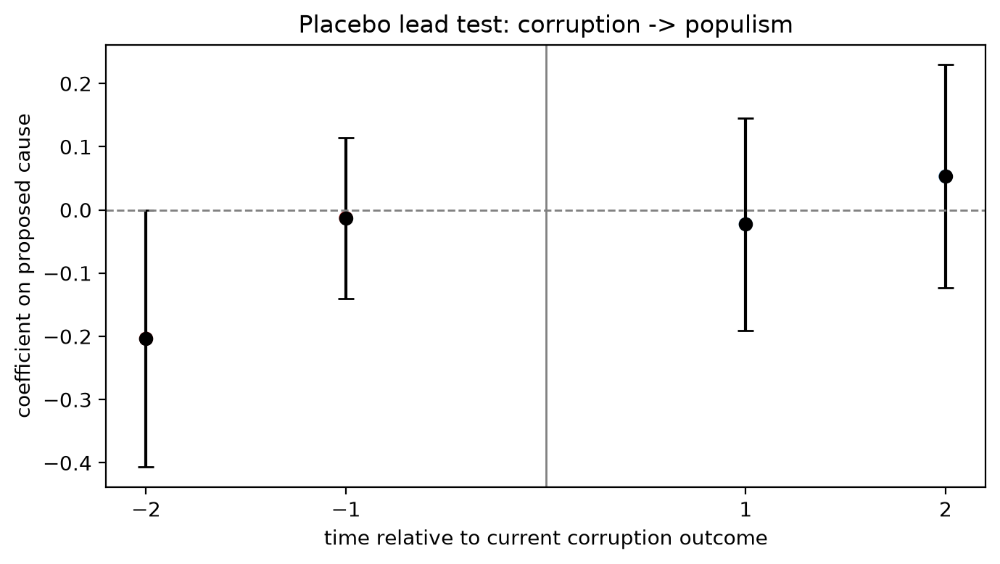
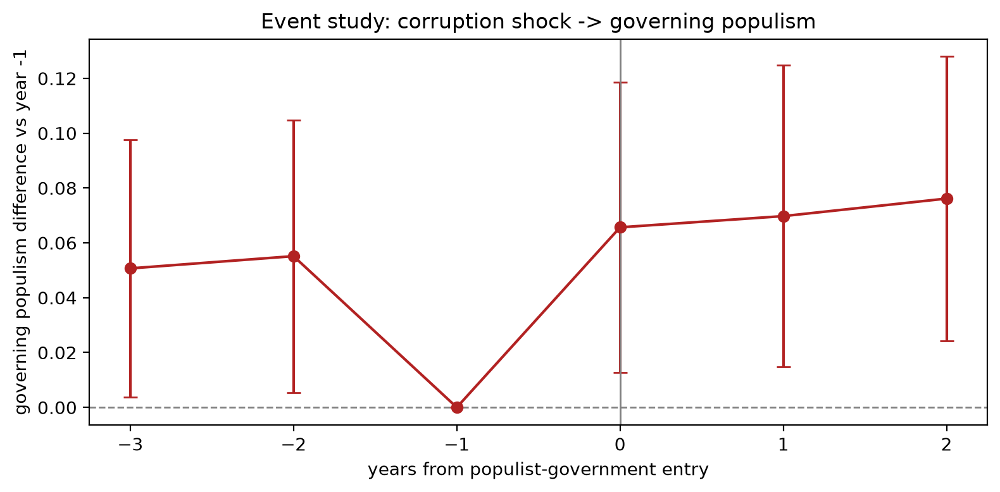
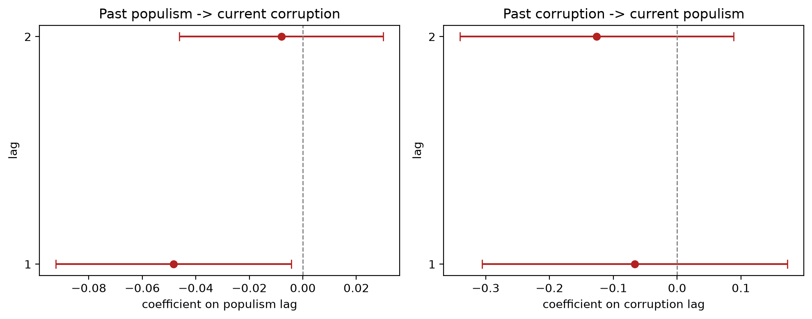
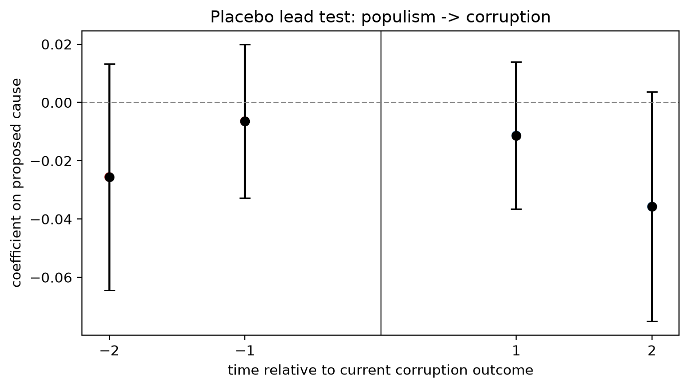
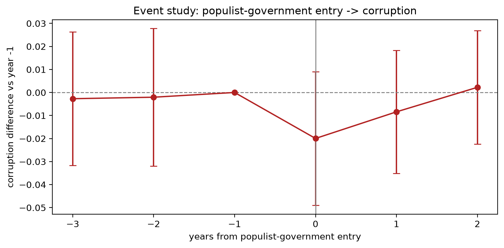
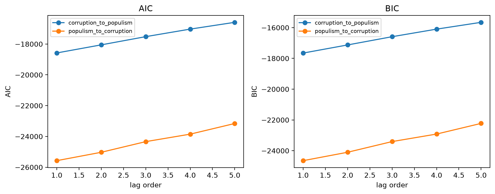
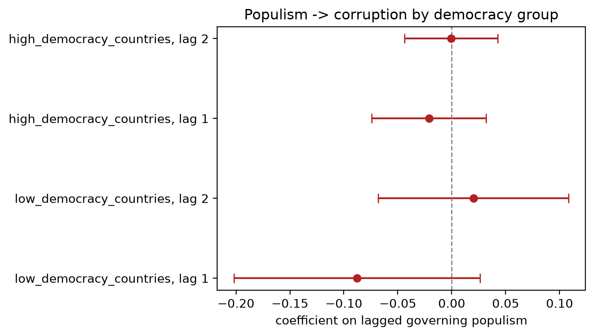

# Causal-direction analysis: bidirectional strengthened version

This document explains the causal-direction notebook in plain language. The runnable version is
`notebooks/04_causal_direction.ipynb`; reusable logic lives in `src/causal_direction/`.

The task is explicitly bidirectional:

1. Does corruption come before later governing populism?
2. Does governing populism come before later corruption?

The study uses the overall V-Dem corruption index:

```text
v2x_corr
```

The corruption subdimensions are left for the decomposition task.

## 1. Data, fixed effects and controls

The panel is `data/processed/panel_populism_corruption.parquet`, with country-year observations from
1970 to 2019.

The core variables are:

- `populism_governing`: governing-party populism, 0-1, higher means more populist.
- `v2x_corr`: overall political corruption, 0-1, higher means more corruption.
- `log_gdppc`: log GDP per capita.
- `v2x_polyarchy`: electoral democracy.

The models include country fixed effects and year fixed effects. Some robustness tools overlap with the association task, especially fixed effects and first differences, but they are used here with a different estimand: the association task tests contemporaneous within-country co-movement, while this task tests temporal ordering through lagged predictors, Granger-style persistence controls, placebo leads, and event-study designs in both directions.

`log_gdppc` and `v2x_polyarchy` are included because they are the most theoretically central
time-varying confounders available in the panel: economic development and electoral democracy can
change within a country and plausibly affect both corruption and the probability of a populist
government. They are not the only possible confounders, but adding many institutional variables can
create over-control or post-treatment bias, especially if those variables are themselves affected by
populist governments.

Both main variables are highly persistent:

- `populism_governing`: autocorrelation about 0.93 at lag 1 and 0.86 at lag 2.
- `v2x_corr`: autocorrelation about 0.99 at lag 1 and 0.98 at lag 2.

This persistence is why Granger-style tests are essential: they ask whether one variable predicts the
other beyond the dependent variable's own past.

## 2. Corruption -> populism

This direction tests whether higher corruption is followed by higher governing populism.

### 2.1 Lead-lag model

The baseline model is:

```text
populism_governing_t ~ v2x_corr_t-1 + v2x_corr_t-2
                       + log_gdppc + v2x_polyarchy
                       + country FE + year FE
```

In the main two-lag lead-lag model, neither corruption lag is statistically clear:

- lag 1 coefficient = -0.066, p = 0.587;
- lag 2 coefficient = -0.126, p = 0.250.

So the simple lead-lag model does not provide clear evidence that corruption predicts later governing
populism.

### 2.2 Granger-style model

The stricter model includes the dependent variable's own lags:

```text
populism_governing_t ~ populism_governing_t-1 + populism_governing_t-2
                       + v2x_corr_t-1 + v2x_corr_t-2
                       + controls + country FE + year FE
```

The two-lag Granger-style joint test gives:

```text
p = 0.241
```

So once the strong persistence of governing populism is included, past corruption does not clearly
add predictive information.

**Comment on `table2_granger`:** this is the central table for the stricter
directional test. The rows with `lag_order = 2` are the main specification. In both directions the
table says `do not reject H0`, meaning the proposed-cause lags are not jointly significant after the
dependent variable's own lags are included.

### 2.3 Placebo lead test

The reverse-direction placebo model is:

```text
populism_governing_t ~ v2x_corr_t-1 + v2x_corr_t-2
                       + v2x_corr_t+1 + v2x_corr_t+2
                       + controls + country FE + year FE
```

Future corruption should not causally affect current governing populism. If future corruption is
significant, the model may be reading pre-trends, anticipation or omitted confounding.

Result:

- future corruption leads are not jointly significant: p = 0.841;
- no placebo warning is triggered.

The placebo table is `table4_placebo_corruption_to_populism`.



### 2.4 Corruption-shock event-study

To make the reverse direction more intuitive, the notebook also estimates an event-study around large
corruption increases:

> What happens to governing populism before and after a corruption shock?

The event is defined as the first within-country yearly increase in `v2x_corr` of at least 0.05. This
identifies 51 events. Year -1 is the reference period.

Results:

- pretrend joint p = 0.083;
- post-event joint p = 0.021;
- event-time coefficients are already positive before the shock and remain positive after it.

This should be read cautiously. The post-event joint test is significant, but the coefficients are
already positive before the corruption shock and the pretrend test is borderline. So the figure is
more consistent with high-populism contexts clustering around the same political episodes as
corruption shocks than with a clean sequence in which the shock first appears and then causes later
governing populism.

The event-study table is `table6_event_study_corruption_shock`.



### 2.5 First differences

The first-difference reverse model asks whether a previous annual change in corruption predicts a
current annual change in governing populism:

```text
Delta populism_governing_t ~ Delta v2x_corr_t-1
                             + Delta controls_t
                             + year FE
```

Result:

- coefficient = -0.016;
- p = 0.585.

Annual changes therefore do not provide a clear reverse-direction signal.

### 2.6 Conclusion for corruption -> populism

The evidence does not robustly support the claim that higher corruption is followed by higher
governing populism. The Granger-style test is not significant, the placebo lead test does not flag a
strong pre-trend issue, and first differences are null. The corruption-shock event-study is the only
piece with a post-event signal, but because the signal is already visible before the shock, it should
be interpreted delicately as contextual clustering rather than clean evidence of a causal direction.

## 3. Populism -> corruption

This direction tests whether governing populism is followed by higher overall political corruption.

### 3.1 Lead-lag model

The baseline model is:

```text
v2x_corr_t ~ populism_governing_t-1 + populism_governing_t-2
             + log_gdppc + v2x_polyarchy
             + country FE + year FE
```

The main two-lag model gives:

- lag 1 coefficient = -0.048, p = 0.031;
- lag 2 coefficient = -0.008, p = 0.680.

This does not support a positive delayed populism-to-corruption effect. If anything, the simple
lead-lag model points in the negative direction at lag 1.



### 3.2 Granger-style model

The stricter model is:

```text
v2x_corr_t ~ v2x_corr_t-1 + v2x_corr_t-2
             + populism_governing_t-1 + populism_governing_t-2
             + controls + country FE + year FE
```

The two-lag Granger-style joint test gives:

```text
p = 0.686
```

So once corruption's own persistence is included, past governing populism does not clearly add
predictive information.

### 3.3 Placebo lead test

The placebo model adds future governing populism:

```text
v2x_corr_t ~ populism_t-1 + populism_t-2
             + populism_t+1 + populism_t+2
             + controls + country FE + year FE
```

Future populism should not causally affect current corruption.

Result:

- future populism leads are not jointly significant: p = 0.096;
- no placebo warning is triggered.

This does not prove causality, but it means the model does not show a strong detectable pre-trend in
this placebo specification.

The placebo table is `table3_placebo_populism_to_corruption`.



### 3.4 Populist-entry event-study

The event-study asks:

> What happens to corruption before and after a large entry into populist government?

An event is the first election year in which governing populism increases by at least 0.10 and reaches
at least 0.50. This identifies 45 events. Year -1 is the reference period.

Results:

- pretrend joint p = 0.983;
- post-entry joint p = 0.228.

So there is no evidence that corruption was already rising before populist entry, but also no clear
evidence that corruption rises after populist entry.

The event-study table is `table5_event_study_populist_entry`.



### 3.5 Forward-fill robustness

`populism_governing` is forward-filled between elections, so many country-years repeat the same
government score. To check whether the baseline result is driven by repeated forward-filled years, the
two-lag populism-to-corruption model is re-estimated on:

- all observations;
- election years only;
- years with a change in governing populism;
- observations within 5 years of the last election;
- observations within 10 years of the last election.

**Comment on `table7_electoral_sample_robustness`:** the negative lag-1 coefficient remains in the
full sample and in the `ffill <= 5` and `ffill <= 10` samples, but it becomes small and imprecise in
election-year-only and government-change-year-only samples. This weakens any claim that the negative
lead-lag result is robustly tied to electoral changes.

### 3.6 First differences

The first-difference model asks whether a previous annual change in governing populism predicts a
current annual change in corruption:

```text
Delta v2x_corr_t ~ Delta populism_governing_t-1
                   + Delta controls_t
                   + year FE
```

Result:

- coefficient = -0.003;
- p = 0.664.

Annual changes therefore do not provide a clear populism-to-corruption signal.

### 3.7 Lag windows and AIC/BIC

The notebook compares Granger-style lag windows from 1 to 5 years. These AIC/BIC values are
approximate diagnostics with shrinking samples: as the lag window grows, early country-years are
dropped, so the models are not always compared on exactly the same observations. With that caveat,
AIC/BIC prefer the one-year Granger specification in both directions, so longer lag windows do not
improve the information-criterion trade-off in these diagnostics.

The table is `table9_lag_information_criteria`.



### 3.8 Democracy heterogeneity

Because the association notebook found that the populism-corruption slope varies with
`v2x_polyarchy`, the causal-direction pipeline adds:

- a lagged populism x polyarchy interaction;
- separate low- and high-democracy country groups.

The lag-1 slope is more negative in lower-democracy contexts and close to zero in higher-democracy
contexts, but the marginal lag effects are not statistically clear. This suggests possible
heterogeneity, not a robust directional result.



### 3.9 Conclusion for populism -> corruption

The evidence does not support the hypothesis that governing populism is followed by higher overall
political corruption. The simple lead-lag model gives a negative one-year coefficient, but this is not
confirmed by the stricter Granger-style model, the event-study does not show a post-entry corruption
jump, and first differences are null.

## 4. Overall report-ready conclusion

The strengthened bidirectional analysis does not provide robust evidence for either temporal
direction. Higher corruption is not clearly followed by higher governing populism once persistence is
accounted for, and governing populism is not clearly followed by higher overall political corruption.
The safest interpretation is therefore no robust temporal direction in the estimated panel
specifications, with especially little support for the hypothesised positive
populism-to-corruption channel.
