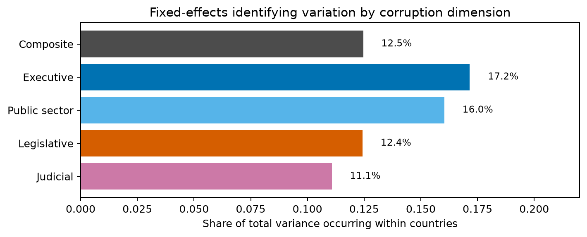
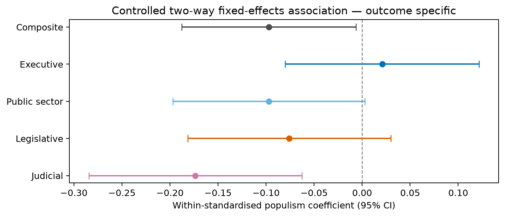
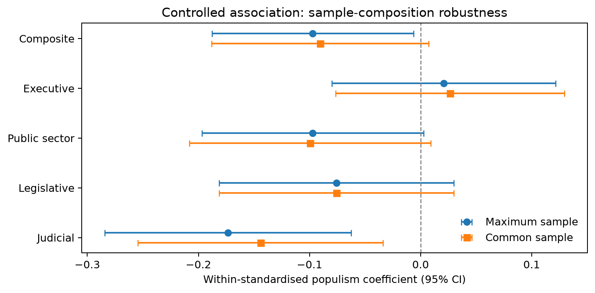
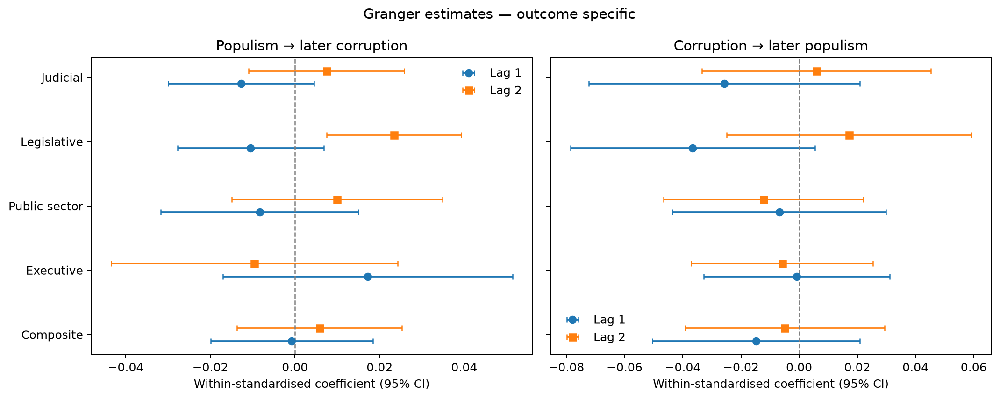
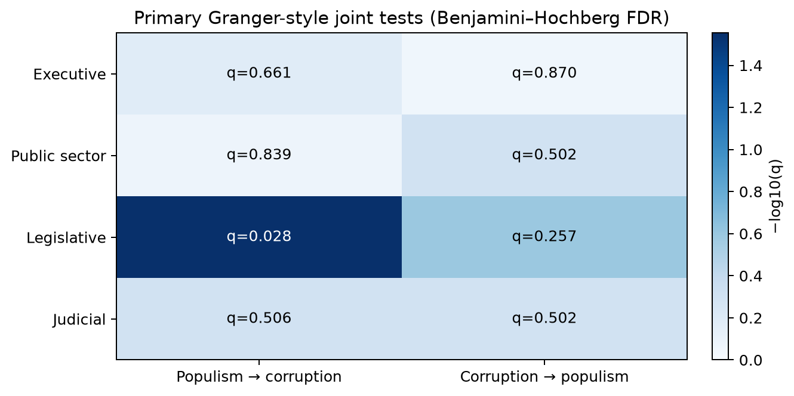

# What Task 5 adds — corruption-dimension decomposition

This document records the question, design, results, robustness checks, and interpretation of the
decomposition analysis. The executable version is `notebooks/05_corruption_decomposition.ipynb`;
reusable code is isolated in `src/decomposition/`; the pre-declared design is in
`specs/corruption_decomposition.md`.

## 1. Why decompose the composite?

Tasks 3 and 4 use `v2x_corr`, an aggregate political-corruption index. Aggregation can conceal a
relationship concentrated in one institution, or average together dimensions that move differently.
Task 5 asks whether the earlier findings hold for:

- executive corruption;
- public-sector corruption;
- legislative corruption;
- judicial corruption.

The composite remains in every table as a benchmark. It is not treated as an additional independent
test because it is constructed from related corruption spheres.

## 2. Measurement decisions

Executive (`v2x_execorr`) and public-sector (`v2x_pubcorr`) corruption already run from cleaner to more
corrupt. The continuous legislative (`v2lgcrrpt`) and judicial (`v2jucorrdc`) estimates run in the
opposite direction, so they are multiplied by -1 before modelling. Every reported positive coefficient
therefore means more corruption.

The `_01` legislative/judicial columns are useful for comparable plots, but they contain only five
values. The continuous latent estimates contain 615 and 544 distinct values in this panel and preserve
far more information. For that reason, the continuous estimates are primary regression outcomes and
the `_01` variables remain descriptive.

## 3. Identification diagnostics

The panel contains 3,965 country-years across 96 countries in 1970–2019. Legislative corruption is
missing for 195 rows, generally because no functioning legislature is coded.

| Outcome | Within-variance share | Lag-1 autocorrelation | Countries with no within variation |
|---|---:|---:|---:|
| Composite | 12.5% | 0.993 | 2 |
| Executive | 17.2% | 0.987 | 3 |
| Public sector | 16.0% | 0.990 | 3 |
| Legislative | 12.4% | 0.992 | 6 |
| Judicial | 11.1% | 0.992 | 5 |

There is enough within-country movement to fit fixed-effects models, but the outcomes are extremely
persistent. This limits power and makes own-outcome lags essential in the temporal models.



## 4. Contemporaneous association

The controlled M3 specification is:

```text
corruption_dimension_it ~ populism_governing_it
                          + log_gdppc_it + v2x_polyarchy_it
                          + country FE + year FE
```

M1–M3 are fitted on a frozen sample for each outcome, with country-clustered standard errors. Because
raw coefficients are not comparable across scales, the cross-dimension effect is reported as:

```text
raw beta * within-SD(populism) / within-SD(outcome)
```

Benjamini–Hochberg FDR correction covers the four subtype M3 tests.

| Outcome | Within-standardised beta | 95% CI | raw p | FDR q |
|---|---:|---:|---:|---:|
| Composite benchmark | -0.097 | [-0.188, -0.006] | 0.036 | — |
| Executive | +0.021 | [-0.080, +0.122] | 0.685 | 0.685 |
| Public sector | -0.097 | [-0.197, +0.003] | 0.057 | 0.113 |
| Legislative | -0.076 | [-0.181, +0.030] | 0.159 | 0.213 |
| Judicial | **-0.173** | **[-0.284, -0.063]** | **0.002** | **0.009** |

The composite's negative Task 3 result is not uniform across institutions. The clearest same-year
negative association is judicial; executive corruption is approximately zero. This does not imply
that populism causes cleaner courts. It is a within-country observational association and could reflect
time-varying confounding, measurement, regime trajectories, or reverse/anticipatory processes.



### Common-sample check

All M3 models were repeated on rows complete for every outcome and control. The judicial estimate
remains negative (standardised beta = -0.144, p = 0.010, q = 0.042); the other subtype conclusions do
not change. The judicial ranking is therefore not explained by its larger available sample.



### Inference and measurement robustness

The judicial M3 coefficient is unchanged and remains FDR-significant under country clustering,
country-and-year clustering, and Driscoll–Kraay covariance estimation. A contemporaneous
first-difference model retains the negative sign (standardised beta = -0.080, raw p = 0.033), but does
not survive correction across the four dimensions (q = 0.134). This weakens an unconditional claim of
significance without reversing the pattern.

The five-level ordinal judicial measure also produces a negative coefficient (standardised beta =
-0.137, p = 0.026). For legislative corruption, both the continuous and ordinal estimates are negative
and imprecise. The main signs therefore do not depend on the latent scale, while the continuous measure
preserves more identifying information and remains the principled primary outcome.

### Democracy interaction

The secondary interaction model reproduces the Task 3 heterogeneity mainly for judicial corruption:
its same-year populism slope is negative at low and median polyarchy and approximately zero at high
polyarchy. These marginal results are secondary and not used as an independent discovery family.

## 5. Temporal direction

The primary two-lag Granger-style model for populism to corruption is:

```text
corruption_dimension_it ~ corruption_dimension_i,t-1 + corruption_dimension_i,t-2
                          + populism_i,t-1 + populism_i,t-2
                          + controls + country FE + year FE
```

The reverse model swaps the dependent variable and proposed cause. A joint Wald test evaluates both
proposed-cause lags. FDR correction is applied jointly to the eight subtype-by-direction tests.

No robust temporal direction appears for executive, public-sector, or judicial corruption. The only
FDR-surviving test is populism to legislative corruption:

```text
joint Wald p = 0.0035
FDR q = 0.0279
```

The individual legislative coefficients are:

| Lag | Raw coefficient | 95% CI | p | Within-standardised coefficient |
|---|---:|---:|---:|---:|
| 1 year | -0.0328 | [-0.0871, +0.0215] | 0.236 | -0.0105 |
| 2 years | **+0.0733** | **[+0.0234, +0.1231]** | **0.004** | **+0.0234** |

Thus the joint signal is driven by a small positive two-year coefficient. Conditional on legislative
corruption's own persistence, higher governing populism is followed by slightly higher measured
legislative corruption two years later. The reverse direction is not significant after FDR
(raw p = 0.064, q = 0.257).





## 6. How robust is the legislative signal?

The result passes some checks but not others:

- **Common sample:** identical legislative estimate and joint result; the common rows are determined by
  legislative availability.
- **Placebo leads:** future populism does not jointly predict current legislative corruption after FDR
  (raw p = 0.101, q = 0.239), so there is no strong placebo warning.
- **First differences:** null (p = 0.374, q = 0.742).
- **Election years:** null and imprecise (joint p = 0.701).
- **Observed government-change years:** null and imprecise (joint p = 0.486).
- **Full / forward-fill <=5 / <=10 samples:** the simpler lead-lag joint test remains significant at
  raw p = 0.018 / 0.023 / 0.014.

This pattern matters. The signal survives the pre-declared primary Granger test and multiplicity
correction, and it is not accompanied by a strong placebo lead. But it is not confirmed by annual
changes or samples tied to actual elections/government-score changes. It may depend partly on the
annual forward-filled representation of governing populism.

The correct label is therefore **suggestive, small, and fragile evidence of a delayed legislative
channel** — not a robust causal effect.

## 7. Overall contribution

The decomposition changes the substantive interpretation in two useful ways:

1. The negative same-year composite association is concentrated most clearly in judicial corruption,
   rather than reflecting all corruption spheres equally.
2. The absence of an overall temporal direction conceals one dimension-specific exception: a small
   positive two-year legislative signal. Its robustness limits prevent a causal claim, but it is a
   more precise institutional hypothesis than the composite result can provide.

### Report-ready conclusion

> After decomposing political corruption, we find no general evidence that populist government is
> followed by higher corruption across institutions. The contemporaneous negative association is
> strongest for judicial corruption, whereas the only positive temporal signal is a small two-year
> legislative effect. Because that legislative result is not confirmed by first-difference or
> election-only checks, it is best interpreted as a possible delayed institutional channel rather than
> causal proof.

## 8. Limitations

- Fixed effects do not remove unobserved confounders that change over time.
- Granger-style tests indicate incremental temporal predictability, not causality.
- Dynamic fixed-effects estimates can have finite-panel (Nickell) bias; the long histories reduce but
  do not eliminate that concern.
- Near-unit persistence raises stationarity concerns; the null first-difference check is therefore
  important evidence against over-interpreting the legislative level result.
- Populism is forward-filled between elections.
- Legislative missingness is structurally related to whether a legislature exists.
- Judicial and legislative scores have little within-country movement in several countries.
- Subdimensions are correlated ingredients of the same composite, not independent replications.
- The expert-coded sources may share perception or coder-related measurement bias.
- Coverage stops in 2019.

## 9. Reproducibility map

- Design: `specs/corruption_decomposition.md`
- Runnable notebook: `notebooks/05_corruption_decomposition.ipynb`
- Models and multiplicity control: `src/decomposition/models.py`
- Figures: `src/decomposition/plots.py`
- Tests: `tests/test_decomposition.py`
- Artifact generator: `scripts/generate_decomposition_artifacts.py`
- Tables: `docs/tables/decomposition/`
- Figures: `docs/figures/decomposition/`
